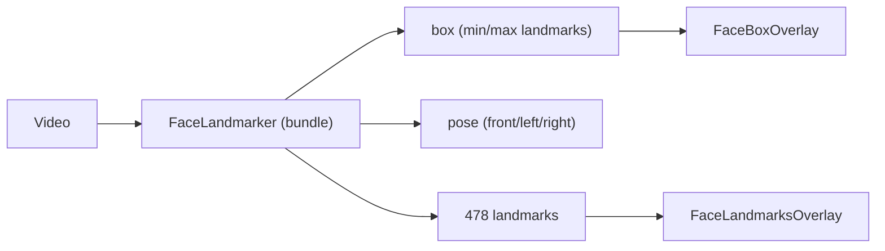

# Face landmarks overlay (web)

> Documento consolidado: [`face-vision-unified.md`](face-vision-unified.md)

Muestra capas configurables del Face Mesh de MediaPipe sobre el video en la web de asistencias. La detección de presencia se unifica en MediaPipe Face Landmarker, que reemplaza al detector BlazeFace standalone para esta ruta.

## Cambio de arquitectura

Antes la detección de presencia usaba `FaceDetector` (BlazeFace) por separado. Ahora una sola inferencia por frame con `FaceLandmarker` entrega caja, pose y los 478 landmarks del Face Mesh.



FaceLandmarker incluye BlazeFace internamente, así que no hay dos modelos en runtime para la detección de presencia.

## Piezas

| Pieza | Archivo | Rol |
|-------|---------|-----|
| Detección | [`facePresenceDetector.ts`](../src/features/recognition/services/facePresenceDetector.ts) | FaceLandmarker → `{ visible, pose, box, landmarks }` |
| Conexiones | [`faceLandmarkConnections.ts`](../src/features/recognition/services/faceLandmarkConnections.ts) | Grupos MediaPipe: TESSELATION, oval, CONTOURS, cejas, ojos, iris, labios |
| Overlay contornos | [`FaceLandmarksOverlay.tsx`](../src/features/recognition/components/FaceLandmarksOverlay.tsx) | Canvas sobre el video; estilo continuo/punteado; capas por grupo; color por `alignment`; soporta `mirror` |
| Overlay marco | [`FaceBoxOverlay.tsx`](../src/features/recognition/components/FaceBoxOverlay.tsx) | Caja rectangular opcional sobre rostro detectado |
| Guia posicion | [`FacePositionGuide.tsx`](../src/features/recognition/components/FacePositionGuide.tsx) | Óvalo objetivo, flechas animadas, barra de zonas (toggles en admin) |
| Config | [`faceAlignmentConfig.ts`](../src/features/recognition/services/faceAlignmentConfig.ts) | Flags de overlay, `faceGuide`, estilo de dibujo, capas |

## Capas visuales configurables (Fase 0a)

Configuración en `FaceCoverageConfig` (localStorage), editable en la página admin de configuración facial:

| Campo | Descripción | Default |
|-------|-------------|---------|
| `showFaceLandmarks` | Master toggle de landmarks | `true` |
| `landmarkDrawStyle` | `'continuous'` (líneas) o `'dotted'` (puntos) | `'continuous'` |
| `landmarkPointSizePx` | Radio de punto en modo punteado (2–8 px) | `3` |
| `landmarkAlignmentColors` | Colores hex por estado: `searching`, `aligned`, `warning` | `#38bdf8`, `#34d399`, `#fbbf24` |
| `landmarkLayers` | Record por capa (ver tabla abajo) | oval/ojos/labios `true`, resto `false` |
| `showFaceBox` | Caja rectangular con esquinas | `false` |
| `faceGuide.showTargetOval` | Marco oval objetivo | `true` |
| `faceGuide.showDirectionArrows` | Flechas animadas (acercar/alejar/centrar) | `true` |
| `faceGuide.showZoneBar` | Barra Lejos / Bien / Cerca | `false` |

### Capas (`FaceLandmarkLayerId`)

Orden de dibujo: tesselation → oval → contours → cejas → ojos → iris → labios.

| ID | Etiqueta UI | Default |
|----|-------------|---------|
| `tesselation` | Malla completa | `false` |
| `oval` | Silueta | `true` |
| `contours` | Contornos | `false` |
| `leftEyebrow` / `rightEyebrow` | Ceja izq./der. | `false` |
| `nose` | Nariz (puente, aletas, punta) | `false` |
| `leftEye` / `rightEye` | Ojo izq./der. | `true` |
| `leftIris` / `rightIris` | Iris izq./der. | `false` |
| `lips` | Labios | `true` |

Modo continuo: traza conexiones por grupo habilitado; tesselation usa `lineWidth` 0.8 y `globalAlpha` 0.45.

Modo punteado: dibuja puntos; tesselation usa los 478 landmarks; demás grupos usan índices únicos de sus conexiones.

Compatibilidad: configs antiguas en localStorage sin los campos nuevos reciben defaults vía `normalizeFaceCoverageConfig`.

## Tipos de salida

```ts
export type FaceLandmarkPoint = { x: number; y: number }
export type FacePoseResult = {
  visible: boolean
  pose: FacePose
  box?: FaceBox
  landmarks?: FaceLandmarkPoint[]
}
```

Los landmarks son normalizados (0-1) en coordenadas de imagen; el overlay los mapea al canvas igual que `FaceBoxOverlay` (porcentaje directo) y aplica `x = 1 - x` cuando `mirror`.

## Integración

- Marcación: [`AttendanceMarker.tsx`](../src/features/attendance/components/AttendanceMarker.tsx)
- Registro: [`useFaceEnrollment.ts`](../src/features/personnel/hooks/useFaceEnrollment.ts) → [`CameraStage.tsx`](../src/features/personnel/components/registration/CameraStage.tsx)
- Preview admin: [`FaceCoveragePreview.tsx`](../src/features/settings/components/FaceCoveragePreview.tsx)

Los contornos se dibujan solo cuando `showFaceLandmarks` está activo. Los toggles y capas viven en [`AdminFaceCoveragePage`](../src/features/settings/pages/AdminFaceCoveragePage.tsx) → [`FaceCoverageControls`](../src/features/settings/components/FaceCoverageControls.tsx) y se previsualizan en vivo antes de guardar.

Colores configurables por estado en `landmarkAlignmentColors`: **buscando** (`searching`), **alineado** (`aligned`) y **ajuste requerido** (`warning`: demasiado lejos, cerca, descentrado o pose incorrecta). Configs antiguas con `landmarkColorMode`/`landmarkColor` se migran al guardar o cargar.

## Modelos

- Unico modelo en cliente: `public/mediapipe/models/face_landmarker.task` (deteccion + mesh para presencia/contornos y alineacion ArcFace offline en [`localFaceDescriptor.ts`](../src/services/localFaceDescriptor.ts) via [`faceVisionService.ts`](../src/features/recognition/services/faceVisionService.ts) + [`faceLandmarkMapping.ts`](../src/features/recognition/services/faceLandmarkMapping.ts)).

## Alcance

- No toca el backend DJL ni la app Android.
- La identidad sigue validándola el backend; esto es solo detección/visual en cliente.

## Build verification (2026-06-25)

- Web: `npm run build` (`tsc && vite build`) — OK.
- Fase 0a: capas configurables de landmarks, estilo continuo/punteado, compatibilidad localStorage.
- Colores por estado: `landmarkAlignmentColors` (`searching`, `aligned`, `warning`) en admin, marcación y registro.
- Fase 4 (offline unify): [`localFaceDescriptor.ts`](../src/services/localFaceDescriptor.ts) usa `detectFromImage` + `landmarksToArcFaceLandmarks` en lugar de BlazeFace standalone; script de modelos solo descarga `face_landmarker.task`.
