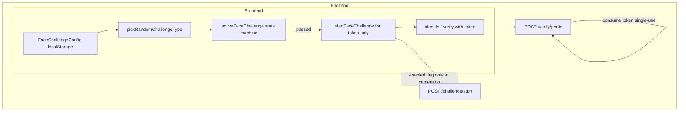
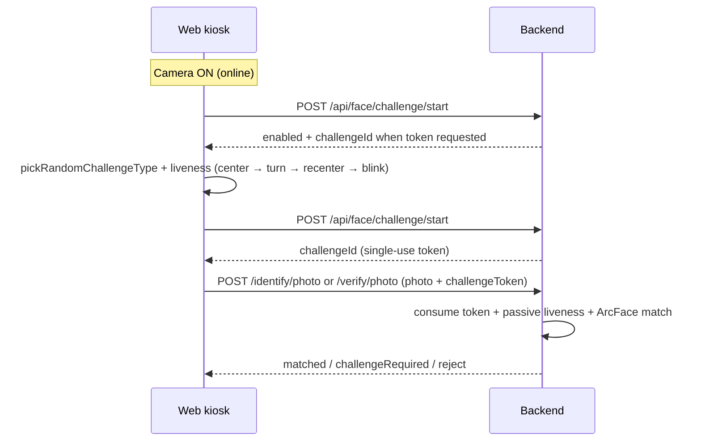

# Active challenge (Nivel B anti-spoofing)

Added 2026-06-24. Implements the decision from the plan "Challenge activo: ¿solo frontend?":
**Nivel B = active challenge in the frontend + single-use `challengeToken` validated in the backend**,
on top of the passive liveness already deployed.

## Why

The facial endpoints (`/api/face/identify/photo`, `/api/face/verify/photo`) accept a JPEG directly.
A frontend-only challenge (Nivel A) guides honest users but does not stop a direct `curl`/Postman
POST with a static photo. Nivel B forces the client to obtain a backend-issued, single-use token and
complete a real head-turn before attendance is recorded, closing the trivial bypass without the cost
of uploading video frames (Nivel C).

## Flow (frontend-first, 2026-06-25)

Responsibilities are split: **the frontend owns all liveness** (online and offline); **the backend only issues and consumes a single-use `challengeToken` after liveness passes when online**.





Offline: same frontend liveness; `challengeToken` stays null; queue sync unchanged.

Effective rules in `AttendanceMarker`:

| Flag | Source |
|------|--------|
| `livenessRequired` | `challengeConfig.enabled` |
| `tokenRequired` | `backendChallengeEnabled && isOnline` |
| Effective liveness | `livenessRequired \|\| tokenRequired` (if backend requires token but FE config disables liveness, liveness is forced anyway) |

Turn direction (`LEFT_TURN` / `RIGHT_TURN`) is chosen locally with independent 50/50 random per turn via `pickRandomChallengeType()`; the same side may repeat on consecutive turns.

## Backend

- `FaceChallengeProperties` (`face.challenge.*`): `enabled`, `ttl-ms`, `require-for-verify` (default `true`),
  `require-for-identify` (default `false`).
- `FaceChallengeService`: in-memory `ConcurrentHashMap` of single-use tokens with TTL. `start()` issues,
  `isValid()` peeks (used by identify), `consume()` removes atomically (used by verify). Enough for one VPS;
  swap to Redis if scaling to multiple instances.
- `FaceVerifyController`: new `POST /api/face/challenge/start`; `identify/photo` and `verify/photo` take an
  optional `challengeToken`.
- `FaceVerifyService`: `verifyAndMarkFromPhoto` consumes the token before doing embedding work and returns
  `VerifyFaceResponse(challengeRequired = true)` when invalid. `identifyFromPhoto` only validates when
  `require-for-identify` is on.

Identify is intentionally not gated by default: it runs in a 450 ms live loop and creates no record, so
gating it would constantly reject. The security-relevant action (creating attendance) is `verify/photo`.

## Web (`asistencia-frontend`)

- `features/recognition/services/faceChallengeConfig.ts`: persisted kiosk config
  (`giga-face-challenge-config`) with per-step toggles, sample counts, yaw thresholds,
  blink thresholds, `mirrorSelfiePerspective`, `usePose3d`, and global `enabled`.
  `pickRandomChallengeType()` selects each turn locally.
- `features/recognition/hooks/useFaceChallengeConfig.ts`: reactive hook for admin UI and kiosk.
- `features/recognition/services/activeFaceChallenge.ts`: pure state machine
  `center -> turn -> recenter -> blink -> passed` fed by `submitAnalysis({ pose, pose3d?, blinkScore?, blinkCycleComplete? })`.
  Disabled steps are skipped via `buildEnabledChallengeSteps`. With `mirrorSelfiePerspective: true`
  the expected turn pose is inverted so instructions match a selfie-style preview. When `usePose3d`
  is on, yaw from MediaPipe facial transformation matrices drives pose instead of nose-offset heuristics.
- `features/recognition/services/facePresenceDetector.ts`: facade over `faceVisionService`; `detectVisibleFacePose`
  returns `pose3d` and `blendshapes` when MediaPipe Face Landmarker provides them.
- `features/recognition/services/faceBlendshapeUtils.ts`: `readBlinkScores`, `detectBlinkCycle` for the blink step.
- `services/faceIdentityService.ts`: `identifyCapturedFace(photo, { challengeToken?, isOnline })` — online via
  `identifyFacePhoto`, offline via local ONNX descriptors + encrypted dataset + local check-in/out state.
- `services/recognitionService.ts`: `startFaceChallenge()`, plus optional `challengeToken` on
  `identifyFacePhoto` / `verifyFacePhoto`, and `challengeRequired` on the response type.
- `features/attendance/components/AttendanceMarker.tsx`: loads challenge config; on camera
  ON (online) calls `startFaceChallenge()` once to read `enabled` only; runs liveness with
  a single `pickRandomChallengeType()` per camera session (preserved on backend status refresh);
  `createActiveFaceChallenge(challengeTypeRef)` reuses that seed for the first turn cycle;
  requests token **after** liveness passes; uses `faceIdentityService`
  for online/offline identification; on `challengeRequired` re-arms the challenge and reopens
  the camera.

### Alineacion previa al reto (2026-06-25)

Antes de cada tick de `submitAnalysis`, el kiosko exige cobertura y centrado correctos via
`evaluateChallengeAlignmentGate()` en [`faceAlignment.ts`](../src/features/recognition/services/faceAlignment.ts):

| Situacion | Validacion |
|-----------|------------|
| Paso `center`, `recenter`, `blink`, o antes de iniciar un giro | `evaluateFaceAlignment(box, pose, null, runtimeConfig)` — distancia + centrado |
| Giro activo (`turn` + `await_turn` + ciclo ya iniciado) | Solo distancia (`evaluateFaceDistance`) — permite desplazamiento lateral al girar |

Umbrales de distancia heredados de `useFaceCoverageConfig` → `toRuntimeConfig('attendance')`:

- `minFaceWidth` = objetivo configurado (too_far si menor).
- `maxFaceWidth` = `computeMaxFaceWidth(objetivo, upperWidthRatio)` = `min(objetivo x ratio, 75%)` (too_close si mayor). Ratio configurable por flujo en admin (default 1.35).

Mientras no pasa la puerta de alineacion, no avanza el reto y el overlay muestra
`faceAlignmentMessage()` (*Acercate*, *Alejate*, *Centra tu rostro*).

Offline: the challenge still runs as frontend liveness when enabled; the token may be null and the offline sync path
(`/attendance/offline-sync`) does not require it.

## Challenge steps (Fase 3)

| Step | Default | Prompt (ES) | Detection |
|------|---------|-------------|-----------|
| `center` | on, 2 samples | Centra tu rostro y mira a la camara | pose front |
| `turn` | on, 1 turn, 1 sample | Gira lentamente la cabeza a tu izquierda/derecha | pose left/right per local `pickRandomChallengeType` + mirror. Multi-turn prompts use `currentTurn = completed + 1` in both `await_turn` and `await_center` so "Giro N de M completado" never shows N=0 after the lateral portion. |
| `recenter` | on, 2 samples | Ahora vuelve al centro | pose front |
| `blink` | on, 1 sample | Parpadea una vez de forma natural | blendshape blink scores + cycle history |

Blink uses MediaPipe `eyeBlinkLeft` / `eyeBlinkRight` via `readBlinkScores`. `AttendanceMarker` keeps a
rolling history (~30 frames) and calls `detectBlinkCycle` with thresholds from config
(`blinkClosedMin`, `blinkOpenMax`). The challenge machine also accepts `blinkCycleComplete` from that helper.

## Frontend config (localStorage)

Key: `giga-face-challenge-config`. Defaults:

```
enabled=true
mirrorSelfiePerspective=false
usePose3d=false
steps.center={enabled:true, requiredSamples:2}
steps.turn={enabled:true, requiredTurns:1, requiredSamples:1}
steps.recenter={enabled:true, requiredSamples:2}
steps.blink={enabled:true, requiredSamples:1}
thresholds.yawFrontDeg=8
thresholds.yawTurnDeg=18
thresholds.blinkOpenMax=0.25
thresholds.blinkClosedMin=0.55
```

Set `enabled=false` to skip all gating in the kiosk (identify loop runs immediately). Admin UI:
`FaceChallengeControls` on settings.

## Android (`IpsAdmin`)

`FaceFrameAnalyzer` gates capture behind the same head-turn sequence using ML Kit's `headEulerAngleY`
(yaw). This is the facial-login flow, which uses `/users/login/face/photo` (not the gated attendance
endpoints), so no backend token is sent; the challenge is client-side liveness parity only.

## Config flags (default)

```
face.challenge.enabled=true
face.challenge.ttl-ms=60000
face.challenge.require-for-verify=true
face.challenge.require-for-identify=false
```

Disable globally with `face.challenge.enabled=false` if a rollback is needed; the FE degrades gracefully
because the endpoint returns `enabled=false` and the token is then treated as optional.

## Build verification (2026-06-25)

```bash
npm run build
```

Result: **OK** after legacy challenge field cleanup (`turnDirection`, backend `type`/`instruction`, `face.challenge.types`).

## Passive liveness hardening (opt-in)

`FaceLivenessService` gained a moiré/screen-replay heuristic (horizontal luma-gradient sign-alternation
ratio). It ships **off** to avoid false rejects until tuned with real photos:

```
face.recognition.liveness.screen-detection-enabled=false
face.recognition.liveness.max-moire-ratio=0.50
```

When enabled, photos whose central region exceeds `max-moire-ratio` are rejected with reason
`SCREEN_REPLAY`.

## Detector strategy decision (evaluation)

Outcome of the "evaluate detector migration" item:

| Layer | Today | Recommendation | Priority |
|-------|-------|----------------|----------|
| Web live (kiosk) | MediaPipe Face Landmarker (pose + blendshapes + optional 3D matrix) | Blink step and `usePose3d` are live; nose-offset pose remains fallback when 3D is off. | Done (Fase 3) |
| Backend detector | Ultranet (DJL) | Migrate to **SCRFD (InsightFace)** for better small/tilted-face detection and real 5-point landmarks aligned with `ArcFaceLandmarkAligner`. Independent of the challenge. | Medium / later |
| Offline web | Face Landmarker IMAGE + 5-point ArcFace alignment (unified with live path) | Same pipeline as kiosk; optional SCRFD ONNX later for parity with backend. | Done (Fase 4) |

Conclusion: client-side vision is unified on Face Landmarker. SCRFD in the backend remains the next precision step and is **not blocking**.
