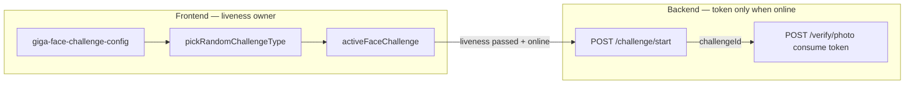
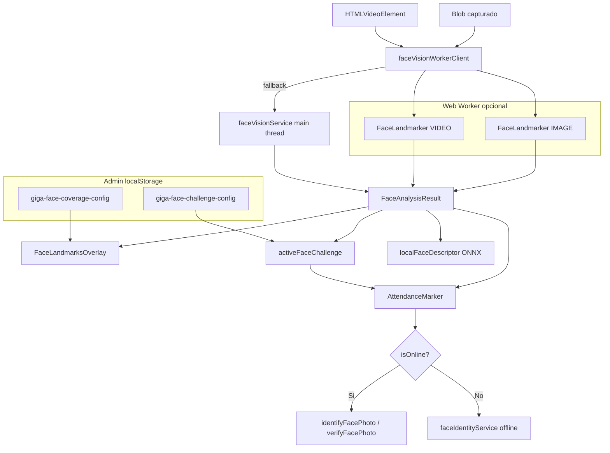

# Face vision unificado (asistencia-frontend)

Documento consolidado de la unificación MediaPipe + liveness + offline (2026-06-25).

Reemplaza y resume: `face-vision-unification-phase1.md`, `face-vision-unification-phase2.md`, secciones relevantes de `face-landmarks-overlay.md`, `face-challenge-config.md` y `face-recognition-active-challenge.md`.

## Arquitectura (responsabilidades FE vs BE)



- **Frontend:** define y ejecuta todo el liveness (online y offline); elige giro (`LEFT_TURN` / `RIGHT_TURN`) localmente.
- **Backend:** emite y consume `challengeToken` de un solo uso **después** de que pase el liveness (solo online). `POST /challenge/start` devuelve `challengeId`, `expiresInMs` y `enabled`.

## Arquitectura (visión unificada)



## Modelo único en cliente

| Recurso | Ruta |
|---------|------|
| Face Landmarker | `public/mediapipe/models/face_landmarker.task` |
| WASM | `/mediapipe/wasm` |
| Descarga | `scripts/download-mediapipe-models.sh` |

No hay `blaze_face_short_range.tflite` standalone. BlazeFace solo existe embebido dentro del bundle Face Landmarker.

## Configuración técnica (código)

### `FACE_VISION_CONFIG` — `src/config/faceCaptureConfig.ts`

| Campo | Valor |
|-------|-------|
| `outputFaceBlendshapes` | `true` |
| `outputFacialTransformationMatrixes` | `true` |
| `numFaces` | `1` |
| `minFaceDetectionConfidence` | `0.35` |
| `minFacePresenceConfidence` | `0.35` |
| `minTrackingConfidence` | `0.5` |

### `FaceCoverageConfig` — `giga-face-coverage-config`

| Campo | Default | Descripción |
|-------|---------|-------------|
| `showFaceLandmarks` | `true` | Master toggle overlay |
| `landmarkDrawStyle` | `continuous` | `continuous` (líneas) o `dotted` (puntos) |
| `landmarkPointSizePx` | `3` | Tamaño punto 2–8 px (modo dotted) |
| `landmarkLayers.*` | oval/ojos/labios on | Ver capas abajo |
| `showFaceBox` | `false` | Marco rectangular |
| `faceGuide.showTargetOval` | `true` | Marco oval objetivo |
| `faceGuide.showDirectionArrows` | `true` | Flechas animadas |
| `faceGuide.showZoneBar` | `false` | Barra Lejos / Bien / Cerca |

Capas (`FaceLandmarkLayerId`), orden de dibujo: tesselation → oval → contours → cejas → ojos → iris → labios.

| ID | Default |
|----|---------|
| `tesselation` | off |
| `oval`, `leftEye`, `rightEye`, `lips` | on |
| `contours`, cejas, iris | off |

### `FaceChallengeConfig` — `giga-face-challenge-config`

| Campo | Default |
|-------|---------|
| `enabled` | `true` |
| `mirrorSelfiePerspective` | `false` |
| `usePose3d` | `false` |
| center / turn / recenter samples | 2 / 1 / 2 |
| blink enabled + samples | on / 1 |
| `yawFrontDeg` / `yawTurnDeg` | 8° / 18° |
| `blinkOpenMax` / `blinkClosedMin` | 0.25 / 0.55 |

Secuencia dinámica: `[center?] → [turn?] → [recenter?] → [blink?] → passed`. Si `enabled=false`, marcación omite el reto.

## Servicios y módulos

| Archivo | Rol |
|---------|-----|
| `faceVisionService.ts` | Instancias lazy VIDEO/IMAGE; `detectFromVideo`, `detectFromImage`; tipo `FaceAnalysisResult` |
| `faceVisionWorkerClient.ts` | Worker Promise API + fallback main thread |
| `workers/faceVision.worker.ts` | Inferencia MediaPipe off-thread |
| `facePresenceDetector.ts` | Fachada: `detectVisibleFacePose`, tipos legacy, fallback `hasHumanLikeFrame` |
| `facePose3d.ts` | yaw/pitch/roll; `deriveFacePoseFromYaw` |
| `faceLandmarkMapping.ts` | `landmarksToArcFaceLandmarks` (33, 263, 1, 61, 291) |
| `faceBlendshapeUtils.ts` | `readBlinkScores`, `detectBlinkCycle` |
| `faceLandmarkConnections.ts` | Grupos MediaPipe para canvas |
| `FaceLandmarksOverlay.tsx` | Canvas continuous/dotted por capa |
| `FacePositionGuide.tsx` | Guia visual de posicion (oval, flechas, barra) |
| `faceChallengeConfig.ts` | Config reto persistida |
| `activeFaceChallenge.ts` | State machine; `submitAnalysis` |
| `faceIdentityService.ts` | `identifyCapturedFace` online/offline |
| `localFaceDescriptor.ts` | Blob → `detectFromImage` → ArcFace ONNX |

## Flujo marcación (`AttendanceMarker`)

1. Carga `useFaceCoverageConfig` (overlay) y `useFaceChallengeConfig` (reto).
2. Al encender cámara (online): `startFaceChallenge()` una vez solo para leer `enabled` del backend.
3. Loop ~450 ms: `detectVisibleFacePose` → pose, pose3d, blendshapes, landmarks.
4. Si liveness efectivo (`config.enabled` o token backend requerido): exige alineacion (cobertura + centrado) antes de procesar cada paso del reto; solo durante un giro activo (`turn` + `await_turn` + ciclo iniciado) valida distancia. Luego `pickRandomChallengeType` + `createActiveFaceChallenge` + `submitAnalysis` + historial parpadeo (~30 frames).
5. Tras liveness: si online y backend habilitado → `startFaceChallenge()` para token → captura → `identifyCapturedFace`.
6. Verify con `challengeToken` (Nivel B anti-spoofing).

## Flujo offline

`Blob` → `ImageBitmap` → `detectFromImage` → `landmarksToArcFaceLandmarks` → `alignFaceToArcFaceCanvas` → ONNX. Fallback: `FACE_OFFLINE_CENTER_CROP_SPECS` sin rostro detectado.

## Admin UI

Página: `AdminFaceCoveragePage` → secciones `CoverageDistanceControls`, `VisualGuideControls`, `LandmarkDiagnosticsControls`, `ChallengeBasicControls`, `ChallengeThresholdControls`. Preview en vivo: `FaceCoveragePreview`.

## Build

```bash
npm run build
```

Verificación 2026-06-25 (frontend-first reto): **OK** (tsc + vite build). Worker bundle: `dist/assets/faceVision.worker-*.js`.

## Documentos relacionados

- Detalle overlay: [`face-landmarks-overlay.md`](face-landmarks-overlay.md)
- Detalle reto + backend token: [`face-recognition-active-challenge.md`](face-recognition-active-challenge.md)
- Fases históricas: [`face-vision-unification-phase1.md`](face-vision-unification-phase1.md), [`face-vision-unification-phase2.md`](face-vision-unification-phase2.md)
